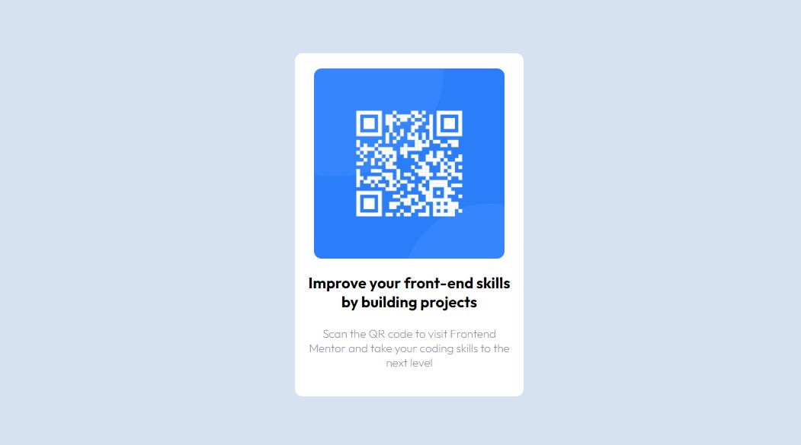
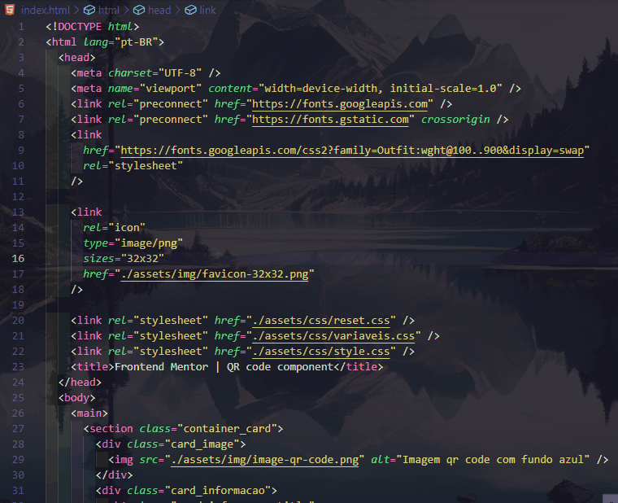

# Frontend Mentor - QR code component

    

## Índice

- [Visão geral](#overview)
  - [O desafio](#O-desafio)
  - [Screenshot](#screenshot)
  - [Links](#links)
- [Meu processo](#my-process)
  - [Construído com](#built-with)
  - [O que eu aprendi](#what-i-learned)
  - [Desenvolvimento contínuo](#continued-development)
- [Autor](#author)
- [Agradecimentos](#acknowledgments)

## Visão geral

### O desafio

Os usuários devem ser capazes de:

- Ver o estado do card com a imagem QR code juntos com o titúlo e o texto

### Screenshot

![]

### Links

- URL da solução: (https://github.com/KaueACLima/projeto-qr-code-component-main)
- URL do site ativo: (https://kaueaclima.github.io/projeto-perfil-de-links-sociais/)

## Meu processo

### Construído com

- Marcação HTML5 semântica
- Propriedades personalizadas CSS

### O que eu aprendi

Graças ao constante aprendizado pode desenvolver esse código sem problemas. Usei a técnica que aprendi com o grupo DEV em DOBRO, fiquei imprecionado com minha conduta. 

[]

## Autor

- Frontend Mentor - [@KaueACLima](https://www.frontendmentor.io/profile/KaueACLima)
- Linkedin - [@Kaue Lima](https://www.linkedin.com/in/kau%C3%AA-lima-234515182/)

## Agradecimentos

Quero agradecer ao Frontend Mentor e ao Dev em dobro por me ajudar chegarem até aqui.

